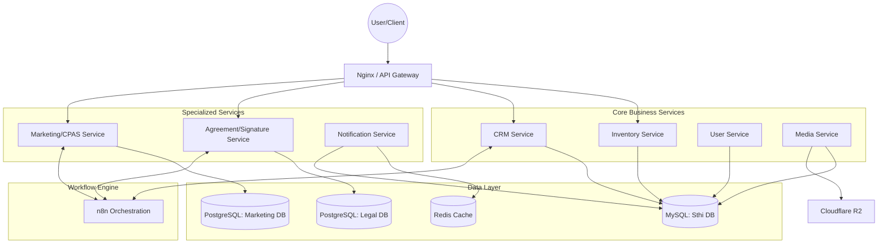

# Sthirvaa High-Level Architecture

This document outlines the distributed architecture of the Sthirvaa platform, detailing the relationship between core services, specialized databases, and automation layers.

## System Overview

Sthirvaa is evolving from a monolithic structure into a microservices-based ecosystem. The architecture is designed to handle high-volume real estate inventory, automated marketing workflows, and secure legal document processing.

## Key Components

### 1. User & Identity (Anchor)
- **Service**: `user-service`
- **Database**: `sthi` (MySQL)
- **Responsibility**: Centralized authentication (OTP/JWT) and global identity. It provides the "User ID" referenced by all other services.

### 2. Real Estate Inventory
- **Service**: `inventory-service`
- **Database**: `sthi` (MySQL)
- **Responsibility**: Manages residential/commercial projects, properties, locations, and amenities. It serves as the primary source of truth for the marketplace.

### 2. CRM & Marketing (Growth Layer)
- **Service**: `crm-service` & `marketing-service`
- **Database**: `sthi` (MySQL) for leads; `marketing` (PostgreSQL) for automation metadata.
- **Workflow**:
    - **Auto Follow-ups**: Automated engagement with leads on social media platforms.
    - **CPAS (Content Post Automation Services)**: Automated content scheduling and posting based on user approval.

### 3. Legal Services (Trust Layer)
- **Service**: `agreement-service`
- **Database**: `legal` (PostgreSQL)
- **Responsibility**: Handles digital agreements and electronic signatures.
- **Features**: Versioned legal templates, audit trails, and integration with e-Sign providers.

### 4. Orchestration & Automation
- **Engine**: n8n
- **Role**: Connects disparate services via webhooks. For example, when a lead is captured in the CRM, n8n triggers the marketing follow-up sequence.

## Inter-Service Communication
- **Synchronous**: REST APIs for direct queries (e.g., Agreement service fetching User data from User service).
- **Asynchronous**: n8n workflows for decoupled, long-running processes (e.g., e-Sign callbacks, scheduled marketing posts).
- **Isolation Policy**: If a non-core service (Agreement/Signature) fails, core features (Login, Inventory) remain functional via circuit-breakers and asynchronous processing.
