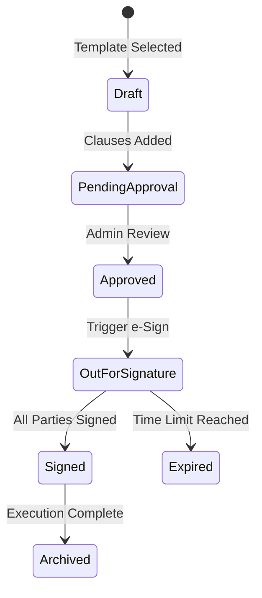

# Legal Services (Agreements & Digital Signatures)

The Legal Services layer ensures that all transactions and agreements on the Sthirvaa platform are legally binding, verifiable, and secure.

## Key Modules

### 1. Agreement Management
This module handles the lifecycle of various real estate agreements (Rental, Sale, MOU, JDA).

- **Template System**: Versioned repository of legal document templates.
- **Clause Negotiation**: Supports JSONB-based term storage to allow for dynamic adjustments to agreement clauses before signing.
- **Audit Trail**: Append-only event logs tracking every state transition of an agreement.

### 2. Digital Signatures (e-Sign)
Secure integration with Aadhaar-based e-Sign providers to facilitate remote signing.

- **Provider Integration**: Supports providers like Leegality or eMudhra.
- **OTP Verification**: Multi-factor authentication for signatories.
- **Status Tracking**: Real-time tracking of who has signed and who is pending.

## Architecture

- **Service**: `agreement-service`
- **Primary Database**: PostgreSQL (Chosen for JSONB support and transactional integrity).
- **Security**: All documents are stored with encryption-at-rest; access is restricted via JWT-based authorization.

## Agreement Lifecycle

## Integration with Inventory
When a property transaction is initiated in the `inventory-service`, a webhook triggers the `agreement-service` to generate a draft agreement pre-populated with property and party details.
