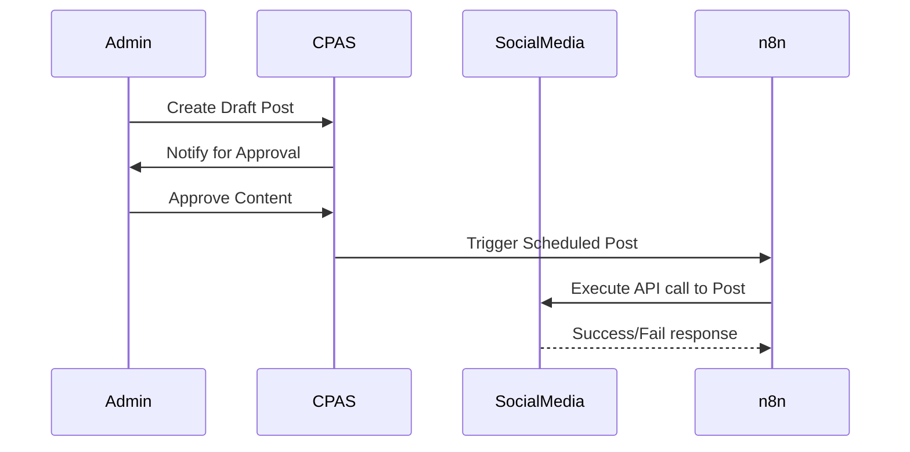

# Marketing & CPAS Service

The Marketing Service is a specialized microservice designed to drive lead engagement and content distribution through automation.

## Core Features

### 1. Auto Follow-ups
This component automates the interaction with leads acquired through social media and other digital channels.

- **Lead Capture**: Tracks new leads from social media accounts (Instagram, FB, etc.).
- **Automated Interaction**: Triggers predefined follow-up sequences (WhatsApp, DM) based on lead activity.
- **n8n Orchestration**: Uses n8n workflows to manage the timing and logic of follow-ups.

### 2. CPAS (Content Post Automation Services)
CPAS streamlines the process of creating and publishing marketing content across multiple platforms.

- **Content Scheduler**: Allows property advisors or admins to queue content for future dates.
- **Approval Workflow**:
    1. Content is drafted (optionally via AI).
    2. Content enters a "Pending Approval" state.
    3. User/Admin reviews and approves via the Dashboard.
    4. CPAS automatically posts the content to linked social media accounts at the scheduled time.
- **Architecture**:
    - **Database**: PostgreSQL (Specialized for scheduling and state management).
    - **Integration**: API-based connection to social media management layers.

## Data Model (Proposed)

| Table | Purpose |
| :--- | :--- |
| `marketing_leads` | Stores social-media specific lead metadata. |
| `content_queue` | Holds pending and scheduled posts. |
| `approval_logs` | Tracks who approved what content and when. |
| `automation_rules` | Configurable rules for the auto-follow-up logic. |

## Workflow Diagram

