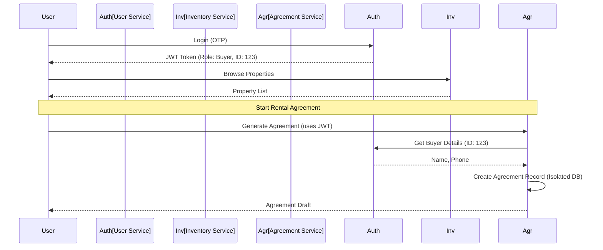

# User Management & Identity Strategy

This document addresses how to design user management (Admins, Advisors, Buyers, Sellers) in a microservices architecture, ensuring fault tolerance and service isolation.

## 1. Core Principle: Identity vs. Profile

To achieve the isolation you requested, we must separate **Identity** (Can this person log in?) from **Domain Data** (What is this person doing in a specific service?).

### The Identity Service (`user-service`)
- **Responsibility**: Authentication (OTP/JWT), basic credentials, and global roles (ADMIN, ADVISOR, USER).
- **Database**: `sthi` (existing users table) - This acts as the "Source of Truth" for login.
- **Fault Tolerance**: If other services (Agreement, Marketing) fail, the User Service remains active for login and Inventory browsing.

## 2. Handling Buyers and Sellers in Agreements

You asked: *"if we keep user in sthi db like buyer, seller they will interact with services db for agreement templates is it it"*

**The Right Way**:
1. **Reference, don't Duplicate**: The `agreement-service` should store a `buyer_id` and `seller_id` which are UUIDs/IDs from the `user-service`.
2. **Parties as Entities**: In the `agreement-service` database (PostgreSQL), create an `agreement_parties` table. 
   - When an agreement is created, the service fetches the minimal required details (Name, Phone, Aadhaar Ref) from the `user-service` and stores them *statically* in the `agreement_parties` table.
   - **Why?** Legal documents must be immutable. Even if the user changes their phone number later in the `user-service`, the signed agreement must reflect the state at the time of signing.

## 3. Service Isolation (Preventing Impact)

To ensure that an error in Agreement generation doesn't crash the Real Estate Inventory:

### A. Asynchronous Integration (Best for Agreement/Signature)
- When a buyer clicks "Generate Agreement", the `inventory-service` sends a message/request to the `agreement-service`.
- If the `agreement-service` is down, the UI shows: *"Agreement service is temporarily unavailable, but you can still browse properties."*
- Core functionality (Inventory) remains untouched because it doesn't *depend* on the Agreement service to function.

### B. Database Isolation
- **Inventory Service** -> MySQL (`re_` tables)
- **Agreement Service** -> PostgreSQL (`agreements` tables)
- **Problem**: What if Agreement service needs Property details?
- **Solution**: The `agreement-service` stores a `property_id`. When rendering the agreement, it makes a quick GET request to `inventory-service/api/properties/{id}`. If the call fails, we use cached data or retry.

## 4. User Archetypes & Ownership

| Archetype | Primary Home | Interaction with Other Services |
| :--- | :--- | :--- |
| **Superuser / Admin** | `user-service` | Manage all services via API Gateway. |
| **Advisor** | `inventory-service` | Assigned to projects; linked to CRM Leads. |
| **Buyer / Seller** | `user-service` | Created when they sign up; referenced by `agreement-service`. |
| **Leads (Unregistered)** | `crm-service` | Potential users. If they convert, they get promoted to `user-service`. |

## 5. Visualizing the Identity Flow

